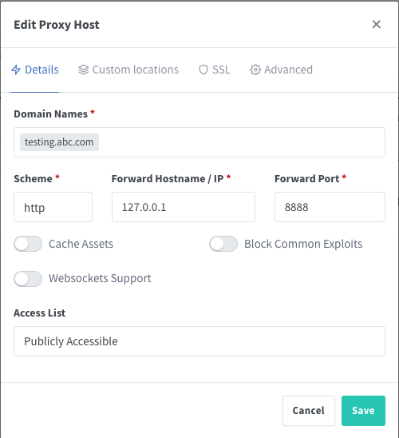
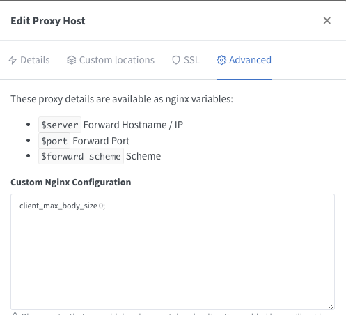

# Directory unrelated
```
blog1/
blog2/
```
you can delete. it for demo deploy nginx for test.

# Running
```bash
docker-compose up -d
```

# Login to Admin UI
http://127.0.0.1:81

### Default Admin User:
```bash
Email: admin@example.com
Password: changeme
```

# Firewall UFW (Ubuntu or Debian)
## important!! 

this for disable port 81 (Admin UI) access from outside.

`ufw` is installed by default on Ubuntu. You can check your already install it by command
```bash
ufw version
```
you can install it with `sudo apt install ufw`

## Checking UFW Status and Rules
```bash
sudo ufw status
```

## Enabling UFW
```bash
sudo ufw enable
```

## Allowing Connections
```bash
sudo ufw allow 22
sudo ufw allow 80
sudo ufw allow 443
```

## Deleing Rules
```bash
sudo ufw delete allow 443
```

## Disabling or Resetting UFW (optional)
```bash
sudo ufw disable
```
```bash
sudo ufw reset
```


## Access port 81 (Admin UI) by ssh tunnelling
```bash
ssh -L 4444:127.0.0.1:81 <user>@<ip>
```
now open http://127.0.0.1:4444 you can access it from your browser.


## Setup Proxy Host ##
ex. subdomain `testing.abc.com` to service runiing port `8888`


### Custom Nginx configuration
ex. `client_max_body_size: 1M` is default Nginx.
